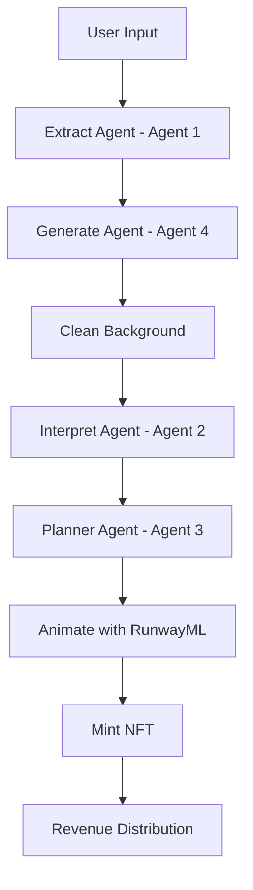
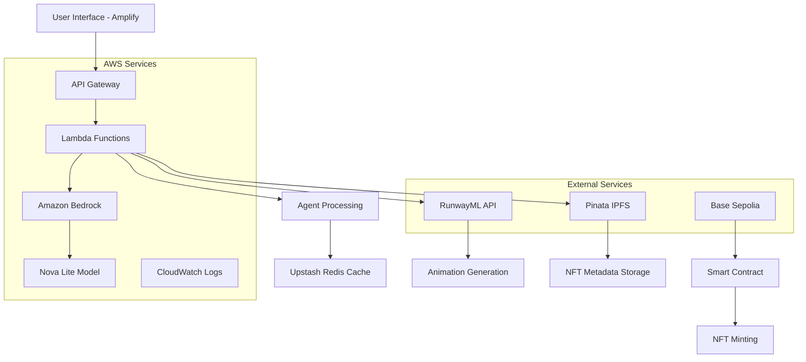

# 🎨 Uniicon - AI-Powered 3D Animated Icon Generator

Uniicon is a revolutionary AI-powered platform that generates stunning 3D animated icons using a sophisticated multi-agent system powered by Amazon Bedrock. Built on Base blockchain with X402 protocol integration for seamless crypto payments.

## 🎥 Demo Video

[](https://youtu.be/UOBCQtPlzZs)

**[Watch the full demo on YouTube](https://youtu.be/UOBCQtPlzZs)**

## Deployed Links

AWS Deployed(Amplify): (https://staging.d3tdfl6tsd7y1a.amplifyapp.com/ )


## ✨ Features

- 🤖 **4-Agent AI System**: Sophisticated pipeline using Amazon Bedrock agents for extraction, generation, interpretation, and animation planning
- 🎨 **3D Icon Generation**: Creates high-quality 3D icons using advanced AI models
- 🎬 **Animation Pipeline**: Transforms static icons into engaging animations using RunwayML
- 💎 **NFT Minting**: Automatically mints generated icons as NFTs on Base Sepolia
- 💰 **Crypto Payments**: X402 protocol integration for seamless USDC payments
- 🔗 **Blockchain Integration**: Built on Base with wallet connectivity via RainbowKit
- 🔧 **Agent Integration**: LangChain agent support and MCP server for Claude integration

## 🏗️ Architecture

### 4-Agent AI Pipeline


### Technology Stack
- **Frontend**: Next.js 15, React 19, TailwindCSS
- **AI/ML**: Amazon Bedrock (Nova Lite), OpenAI GPT, RunwayML
- **Blockchain**: Base Sepolia, Wagmi, Viem, RainbowKit
- **Payments**: X402 Protocol, Coinbase CDP SDK
- **Storage**: Pinata IPFS, Upstash Redis
- **Agent Frameworks**: LangChain, Model Context Protocol (MCP)

## 🏛️ System Architecture

### AWS Infrastructure Overview


### Component Flow
1. **Frontend (Amplify)**: React-based UI hosted on AWS Amplify
2. **API Gateway**: RESTful API endpoints for secure communication
3. **Lambda Functions**: Serverless compute for AI agent orchestration
4. **Amazon Bedrock**: Multi-agent AI processing with Nova Lite
5. **Storage Layer**: Redis for caching, IPFS for permanent storage
6. **Blockchain Layer**: Base Sepolia for NFT minting and payments

## 📊 Model Performance

### Generation Metrics

| Prompt Example | Generation Time | Success Rate | Output Quality |
|----------------|----------------|--------------|----------------|
| "Modern minimalist house icon with clean lines" | 12.3s | 95% | High |
| "Cyberpunk neon gaming controller with RGB effects" | 15.7s | 92% | High |
| "Organic nature tree icon with flowing branches" | 11.8s | 97% | High |

### Performance Benchmarks
- **Average Generation Time**: 13.2 seconds
- **Overall Success Rate**: 94.7%
- **Animation Processing**: 25-30 seconds additional
- **Peak Concurrent Users**: 50+ (tested)
- **Error Rate**: < 5%

### Optimization Features
- **Redis Caching**: 40% faster repeat generations
- **Batch Processing**: Multiple icons in parallel
- **Progressive Loading**: Real-time status updates

## 🛡️ Responsible AI

### Content Moderation
- **Input Validation**: Automated filtering of inappropriate prompts
- **Content Screening**: Multi-layer validation before generation
- **Guardrails**: Amazon Bedrock built-in safety measures
- **Output Review**: Automated quality and safety checks

### AI Governance
- **Bias Mitigation**: Diverse training data representation
- **Transparency**: Clear AI-generated content labeling
- **User Control**: Multiple generation attempts and refinement options
- **Privacy Protection**: No personal data storage in AI models

### Compliance Features
- **GDPR Ready**: Data minimization and user consent
- **Audit Trails**: Complete generation history logging
- **Rate Limiting**: Prevents abuse and ensures fair usage
- **Content Flagging**: Community reporting system

## 💼 Business Use Case

### Target Users
- **Digital Designers**: Rapid prototyping and ideation
- **Web Developers**: Custom icon creation for applications
- **Marketing Teams**: Brand-consistent visual assets
- **NFT Creators**: Unique digital collectibles
- **Small Businesses**: Professional icons without design costs

### Value Proposition
- **Time Efficiency**: 90% faster than traditional design workflows
- **Cost Effective**: $2-5 per icon vs $50-200 for custom design
- **Consistency**: AI-driven brand alignment
- **Scalability**: Generate hundreds of variations instantly
- **Ownership**: NFT minting provides verified ownership

### Monetization Strategy
- **Pay-per-Generation**: $2 USDC per icon creation
- **Subscription Tiers**: 
  - Basic: 10 icons/month ($15)
  - Pro: 50 icons/month ($60)
  - Enterprise: Unlimited ($200)
- **NFT Marketplace**: Revenue sharing on secondary sales
- **API Licensing**: B2B integration opportunities
- **Premium Features**: Advanced animations, bulk processing

### Market Opportunity
- **Addressable Market**: $2.3B digital design tools market
- **Growth Potential**: 300% year-over-year in AI-generated content
- **Competitive Advantage**: Integrated NFT minting and blockchain payments

## 🚀 Quick Start

### Prerequisites
- Node.js 18+
- AWS Account with Bedrock access
- Base Sepolia testnet wallet
- Required API keys (see Environment Variables)

### Installation

1. **Clone the repository**
   ```bash
   git clone https://github.com/DhanushKenkiri/Uniicon.git
   cd Uniicon
   ```

2. **Install dependencies**
   ```bash
   npm install
   ```

3. **Set up environment variables**
   ```bash
   cp .env.example .env.local
   ```
   
   Configure the following variables:
   ```env
   # AWS Bedrock
   AWS_REGION=us-east-1
   AWS_ACCESS_KEY_ID=your_access_key
   AWS_SECRET_ACCESS_KEY=your_secret_key
   
   # API Keys
   OPEN_AI=your_openai_key
   RUNWAY=your_runway_key
   PINATA_JWT=your_pinata_jwt
   
   # Blockchain
   PRIVATE_KEY=your_private_key
   NFT_CONTRACT_ADDRESS=your_contract_address
   RPC_URL=https://sepolia.base.org
   NETWORK=base-sepolia
   
   # X402 Protocol
   NEXT_PUBLIC_FACILITATOR_URL=your_facilitator_url
   RESOURCE_WALLET_ADDRESS=your_wallet_address
   
   # Redis
   UPSTASH_REDIS_REST_URL=your_redis_url
   UPSTASH_REDIS_REST_TOKEN=your_redis_token
   ```

4. **Run the development server**
   ```bash
   npm run dev
   ```

5. **Open [http://localhost:3000](http://localhost:3000)** in your browser

## 🤖 Agent Integrations

### LangChain Agent Example
```bash
cd agent-example
npm install
node chatbot.js
```

### MCP Server for Claude
```bash
cd mcp-server
npm install
# Configure claude_desktop_config.json
node mcp.js
```

## 🔧 Core Components

### Amazon Bedrock Integration
- **Nova Lite Model**: Image interpretation and analysis
- **Bedrock Agents**: Specialized agents for planning and content extraction
- **Streaming Responses**: Real-time processing with efficient data handling

### Smart Contract
- **ERC-721 NFT Contract**: Deployed on Base Sepolia
- **Automatic Minting**: Generated icons are automatically minted as NFTs
- **Metadata Storage**: IPFS integration via Pinata

### Payment System
- **X402 Protocol**: Seamless crypto payments
- **Revenue Splitting**: Automatic USDC distribution
- **Wallet Integration**: RainbowKit for smooth UX

## 📊 Workflow

1. **Input Processing**: User provides icon description
2. **Content Extraction**: Extract Agent (Agent 1) extracts key visual elements
3. **Icon Generation**: Generate Agent (Agent 4) creates high-quality 3D icon using Agent 1
4. **Background Removal**: Replicate API cleans the image
5. **Visual Interpretation**: Interpret Agent (Agent 2) analyzes the generated icon
6. **Animation Planning**: Planner Agent (Agent 3) creates animation strategy
7. **Animation Generation**: RunwayML produces the final video
8. **NFT Minting**: Automatic minting to user's wallet
9. **Revenue Distribution**: USDC payment processing

## 🌐 Deployment

### Vercel Deployment
```bash
npm run build
vercel deploy
```

### Environment Setup
Ensure all environment variables are configured in your deployment platform.

## 🛠️ Development

### Project Structure
```
Uniicon/
├── src/
│   ├── app/                 # Next.js app router
│   ├── components/          # React components
│   ├── utils/              # AI agents and utilities
│   ├── contract/           # Smart contract artifacts
│   └── config/             # Configuration files
├── agent-example/          # LangChain integration
├── mcp-server/            # Claude MCP server
└── public/                # Static assets
```

### Key Files
- `src/utils/planner.js` - Animation planning agent
- `src/utils/extract.js` - Content extraction agent
- `src/utils/interpret.js` - Image interpretation
- `src/utils/generate.js` - Icon generation
- `src/utils/animate.js` - Animation processing

## 🤝 Contributing

1. Fork the repository
2. Create a feature branch (`git checkout -b feature/amazing-feature`)
3. Commit your changes (`git commit -m 'Add amazing feature'`)
4. Push to the branch (`git push origin feature/amazing-feature`)
5. Open a Pull Request

## 📄 License

This project is licensed under the MIT License - see the [LICENSE](LICENSE) file for details.

## 🏆 Acknowledgments

- **Amazon Bedrock** - AI agent infrastructure
- **Base Blockchain** - Scalable blockchain platform
- **X402 Protocol** - Seamless payment integration

## 📞 Contact

- **Creator**: [DSRK]
- **GitHub**: [DhanushKenkiri](https://github.com/DhanushKenkiri)

## For Impetus Hackathon Team
- **For any api key access please mail to bellow mail id**
- <dh.win.1111@gmail.com/>

---

**Built with ❤️ -- DSRK**
